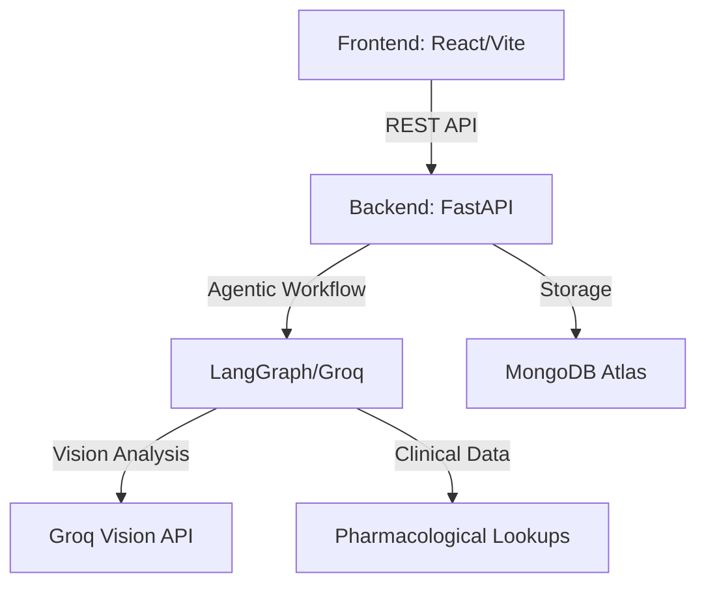

# 🔬 RxEngine AI | Medical Decision Support System

[](https://www.python.org/)
[](https://fastapi.tiangolo.com/)
[](https://react.dev/)
[](https://www.typescriptlang.org/)
[](https://www.mongodb.com/)
[](https://groq.com/)

**RxEngine AI** is a state-of-the-art Clinical Decision Support System (CDSS) designed to assist healthcare professionals in analyzing prescriptions, detecting drug-drug interactions (DDI), and automating clinical workflows using an agentic AI approach.

---

## 🚀 Key Features

*   **⚡ AI-Driven Agentic Workflow:** Uses multi-agent orchestration (LangGraph) to perform structured medical analysis, from OCR extraction to clinical reasoning.
*   **👁️ Intelligent OCR:** High-precision extraction of handwritten and printed prescriptions using **Groq Vision** and **PyTesseract**.
*   **🛡️ Conflict & Interaction Detection:** Automated detection of potential drug-drug interactions and dosage conflicts.
*   **📊 Clinical Dashboard:** Real-time visualization of analysis results, patient history, and automated clinical summaries.
*   **🔐 Secure Clinical Portal:** Multi-role authentication (Clinician/Admin) with **JWT** session management and **Bcrypt** security.
*   **🌙 Premium Aesthetics:** High-performance UI built with **Framer Motion**, **Tailwind CSS**, and support for dynamic visual feedback.

---

## 🏗️ Architecture



---

## 📁 Project Structure

```text
/
├── backend/            # Python (FastAPI) Web Server
│   ├── app/            # Core logic, APIs, and Services
│   ├── requirements.txt
│   └── seed.py         # Database initialization
├── frontend/           # React (TypeScript) Application
│   ├── src/            # Components, Hooks, and Services
│   ├── public/         # Static assets
│   └── package.json
└── README.md
```

---

## ⚙️ Getting Started

### 1. Prerequisites
- **Node.js** (v18+)
- **Python** (v3.10+)
- **MongoDB Atlas** Account
- **Groq API Key**

### 2. Backend Setup
```bash
cd backend
python -m venv venv
source venv/bin/activate  # venv\Scripts\activate on Windows
pip install -r requirements.txt
```
Create a `.env` file in `/backend`:
```env
GROQ_API_KEY=your_key_here
MONGODB_URI=your_mongodb_uri
DB_NAME=clinical_resolution_db
PORT=8005
SECRET_KEY=your_secret_key
```
Run the server:
```bash
python -m uvicorn app.main:app --port 8005 --reload
```

### 3. Frontend Setup
```bash
cd frontend
npm install
```
Create a `.env` file in `/frontend`:
```env
VITE_API_BASE_URL=http://127.0.0.1:8005/api/v1
```
Run the development server:
```bash
npm run dev
```

---

## 🧪 Demonstration Credentials
To preview the system, you can use the default clinician account:
- **Email:** `doctor@rxengine.com`
- **Password:** `password`

---

## 🛠️ Tech Stack
- **Frontend:** React 19, TypeScript, Vite, Tailwind CSS, Framer Motion, Axios, Lucide React.
- **Backend:** FastAPI, Python, Motor (Async MongoDB), LangGraph, Groq SDK, PyTesseract, JWT.
- **Database:** MongoDB Atlas (NoSQL).
- **AI/ML:** Groq LPU™ Inference, Groq-Vision-Llama, LangChain.

---

## 📄 License
This project is licensed under the MIT License.
